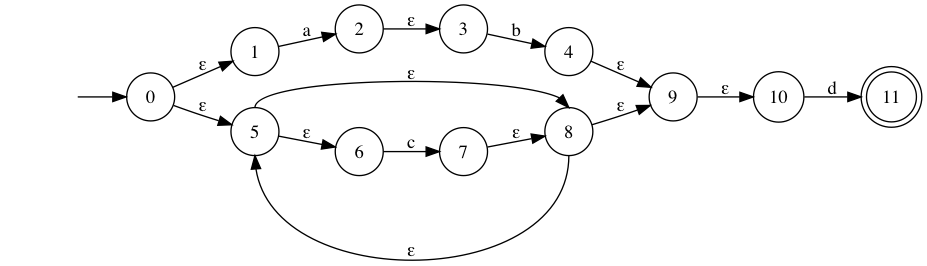
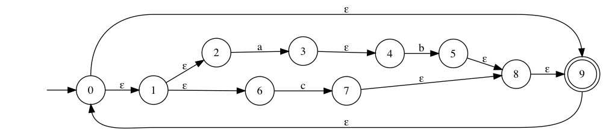

# Discussion 09 -- Review and Automata

There is an exercise on Gradescope you must complete.

**Due: Tue, Jun 30 2020** (Due the same day as discussion)

### Q1. Which of the strings will be accepted by the NFA?

```
     [ ] d
     [ ] ababd
     [ ] cccabd
     [ ] cd
     [ ] cccccd
```
### Q2. How many states exist in the DFA created by reducing the following NFA?

```
    [ ] 2
    [ ] 3
    [ ] 4
    [ ] 5
```

---

### Q3. Write a regular expression accepted by the following NFA

### Q4. Create an NFA that accepts `(a|b*c)*(da)*`
### Q5. Create an NFA that accepts strings with any number of `"a"`so and an Odd number of `"b"`s 

---

### Q6. Convert the above NFA to a DFA
