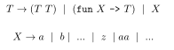
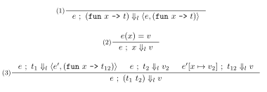

# Discussion 12: NanOCaml Semantics


## Introduction

We are implementing a stripped down version of OCaml called NanOCaml.
Today, we will focus only on the semantics of NanOCaml, in other words
  writing the evaluator.
You are expected to implement the `eval` function (along with their helpers).

`eval` uses the environment semantics for lexically-scoped NanOCaml
  from Figure below.
You may find the `List.assoc_opt` function
  helpful for looking things up in your environment.
You will have written some of this yourself,
  so make sure you get the rules right!

Our semantics define a partial function (i.e. not all inputs have an output).
**If a term does not evaluate under our semantics,
  you must raise an exception (any will do).**
For example, attempting to evaluate an unbound variable 
  or apply something other than a function would yield an error.


## The CFG 

The CFG for the NanOCaml is the same as last week. 

> 

We have provided the lexer and parser from the previous discussion,
  in case if you haven't managed to finish it. 

This CFG will produce an AST which is what we'll be using in today's discussion.

## The environment model Our semantics is centered around the idea of substitution.
When we apply an argument to the function, we substitute it in for 
  all the occurrences of the parameter in the function body. 

To explicitize it in semantics we will be following these semantics. 

> 

Similar to OCaml, NanOCaml use closures to keep track of the variables that have been bound. 
To represent this in our program we use the following types
- `type 'a env = (var * 'a) list` : This is the parametrized environment type
  which holds the map of variable names to their values. 
- `type closure = Closure of closure env * expr` : 
  Each closure contains the environment and the expression associated with it.

## Evaluator
In this exercise, you will have to implement the following functions. 

## `eval : expr -> expr` 

This is the function that a user of NanOCaml will call to simplify expressions. 
e.g.
```
((fun x -> x x) (fun y -> y)) => (fun y -> y)
```

Usage: 
```
"((fun x -> x x) (fun y -> y))" |> Lexer.lex |> Parser.parse |> Evaler.eval;;
- : Parser.expr = Prser.Fun ("y", Parser.Var "y")
```

## `eval_eps ; closure env -> expr -> closure`

This function evaluates the expression under the environment given and
  returns the changed environment. 

## The REPL

Once you've written the evaluator, our language pipeline will be complete.
You can write programs in your language and run them! Provided is an
interface to your language `OCAMLPATH=dep dune exec bin/repl.bc`.

As a challenge, try to discover a term in your language that doesn't terminate.
You can also extend NanOCaml to implement more and more features of real
OCaml. Or you can come up with your own unique language features.
